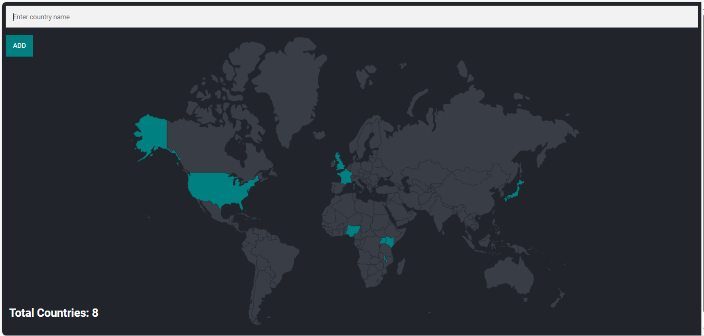
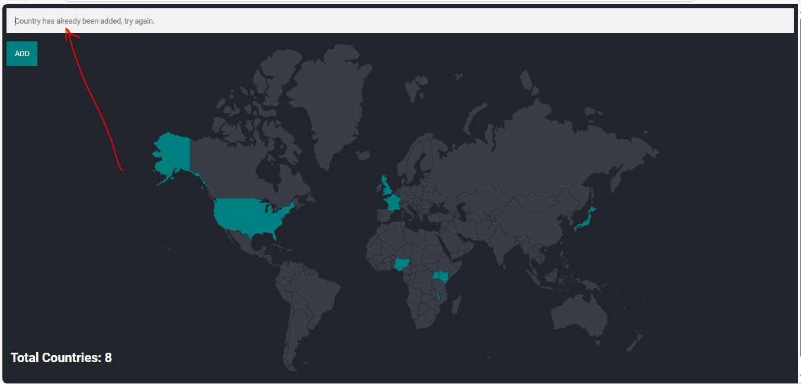

# Travel Tracker Web app

## Description
The Travel Tracker is a web application that allows users to track the countries they have visited. The app provides a user-friendly interface where users can input a country name after which the country entered is highlighted on the world map.

## Features
- Input and add country names to your visited countries list.
- View a map with the visited countries highlighted.
- Real-time tracking of total visited countries.
- User-friendly interface with error handling for invalid or duplicate country names.

## Demo

1. Home page showing the world map while highlighting current visited countries contained in the database.

2. Input a country name in the text field located at the top of the page. Click "Add" to add the country.

3. If the country is valid, it will be added to your visited countries list.

4. If you enter a country that you had already entered, an error message will notify you that the country has already been added.


## Technologies Used
- **Frontend**: HTML, CSS, EJS (Embedded JavaScript)
- **Backend**: Node.js, Express.js
- **Database**: PostgreSQL
- **Other**: Body-Parser for parsing POST requests

## Setup and Installation

### Prerequisites
Make sure you have the following installed:
- **Node.js**: [Download Node.js](https://nodejs.org/)
- **PostgreSQL**: [Download PostgreSQL](https://www.postgresql.org/download/)

### Installation Steps

1. Clone the repository:

    ```bash
    git clone https://github.com/JemoGithirwa4/Travel-tracker.git
    ```

2. Navigate into the project directory:

    ```bash
    cd Travel-tracker
    ```

3. Install dependencies:

    ```bash
    npm install
    ```

4. Set up PostgreSQL database:
    - Create a new database `world` in PostgreSQL.
    - Create two tables:
        - `countries` (with `id`, `country_code` and `country_name` columns).
        ```bash

            CREATE TABLE countries(
                id SERIAL PRIMARY KEY,
                country_code CHAR(2),
                country_name VARCHAR(100)
            );
        ```

        - `visited_countries` (with `id`, `country_code` column).
        ```bash

            CREATE TABLE visited_countries(
                id SERIAL PRIMARY KEY,
                country_code CHAR(2) NOT NULL UNIQUE
            );
        ```
    - Import this [country.csv](https://drive.google.com/file/d/1VLdZ0OFXR-geArMFrdoOZsreUgCOunjQ/view?usp=sharing)  csv file in Postgresql to Populate the `countries` table with country names and their corresponding codes.

5. Run the application:

    ```bash
    npm start
    ```

Your app will be available at `http://localhost:3000`.

## Usage

1. Open the application in your browser.
2. Input a country name in the text field.
3. If the country is valid, it will be added to your visited countries list.
4. If you re-enter a country, an error message will notify you that the country has already been added.

## Code Explanation

- **Express.js** handles routing and serves the front-end.
- **pg** is used to interact with the PostgreSQL database to store and retrieve country data.
- **EJS** is used to dynamically render the list of visited countries and the total count.
- **Body-Parser** middleware parses the form input.